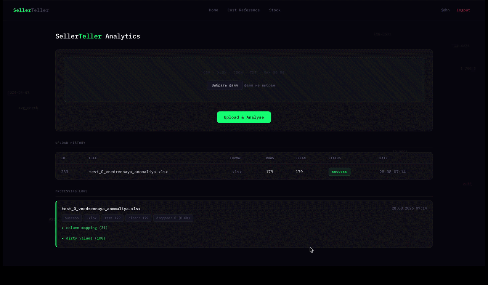
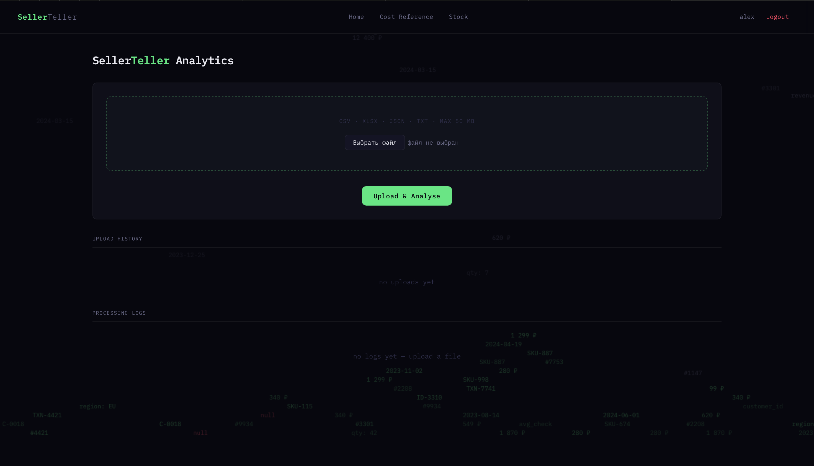
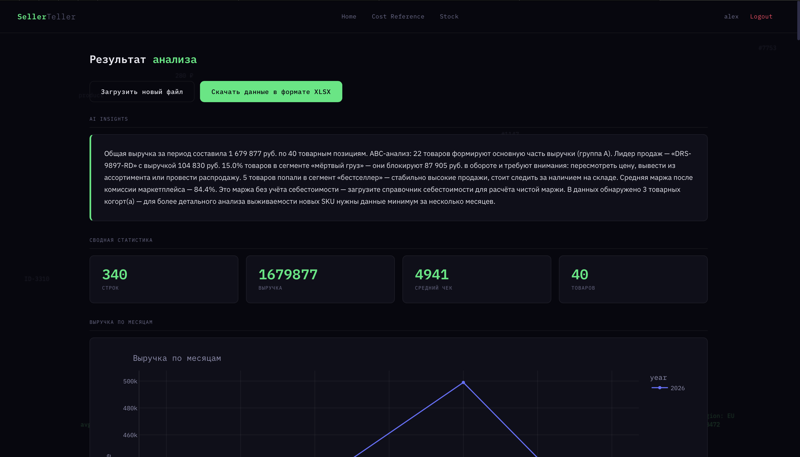
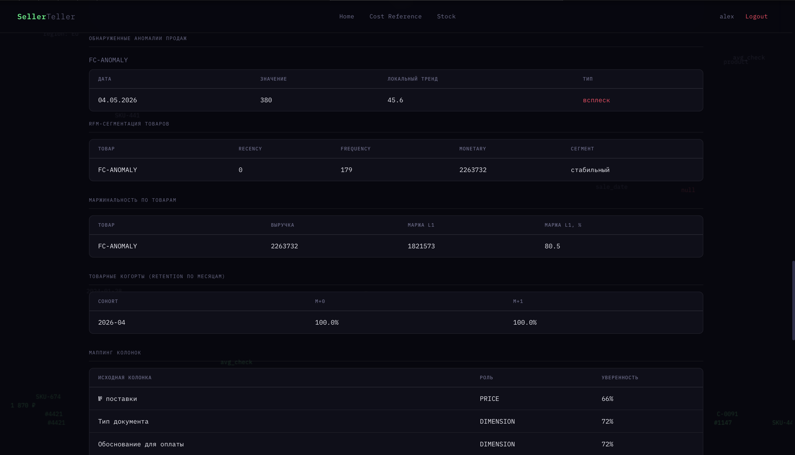

# SellerTeller

**Загрузи отчёт из личного кабинета Wildberries или Ozon — через минуту получи объяснение, какие товары умирают, какие тянут прибыль вниз и что делать в следующем месяце.**

Аналитическая платформа для продавцов на маркетплейсах: принимает «грязную» выгрузку в любом формате, сама распознаёт структуру файла и возвращает не графики, а текстовый разбор ситуации.


---

## Демо



| Загрузка | Результат анализа | Аномалии |
|---|---|---|
|  |  |  |

---

## Проблема

Продавец на WB/Ozon скачивает отчёт о реализации и видит таблицу на 30 колонок и тысячи строк. Чтобы понять, какие позиции убыточны, а какие перестали продаваться, он вручную сводит данные в Excel — это часы работы каждую неделю.

Хуже того, у отчётов разных площадок **разные названия одних и тех же колонок**, разные кодировки и разделители, а суммы приходят в формате `5 326,06` — то есть автоматизировать «в лоб» не выходит.

**Аудитория:** магазины на WB/Ozon с оборотом от 300 тыс. до 10 млн ₽ в месяц.

---

## Что умеет

| Модуль | Возможность |
|---|---|
| **Classification** | Автоматически определяет тип отчёта — 9 форматов WB/Ozon — и честно отказывается считать аналитику по финансовой сверке |
| **Data Ingestion** | Распознаёт роли колонок по содержимому, а не по названию: работает с переименованными заголовками, cp1251, `;`/таб-разделителями и русским форматом чисел |
| **ABC / Pareto** | Разбивает ассортимент на группы по вкладу в выручку |
| **Маржинальность** | Два раздельных слоя: после комиссии маркетплейса и чистая маржа после себестоимости — никогда не смешиваются в одну цифру |
| **Товарный RFM** | Сегменты «бестселлер», «мёртвый груз», «скрытый потенциал», «угасающий хит» |
| **Lifecycle Cohorts** | Когорты товаров по месяцу первой продажи — видно, как быстро «вымирают» новые SKU |
| **Forecast / Anomaly** | Прогноз продаж и остатков на 30 дней, дата исчерпания запаса, детекция всплесков и провалов |
| **AI Insights** | Связный текст на русском с опорой на конкретные цифры, с fallback на шаблонный генератор при недоступности LLM |

---

## Технологии

| Слой | Стек |
|---|---|
| **Backend** | Python 3.11, Flask 3.0, Gunicorn |
| **Данные и ML** | pandas 2.2, scikit-learn 1.5 (KMeans), NumPy |
| **Визуализация** | Plotly 5.22 |
| **LLM** | Провайдер-агностичный интерфейс `LLMProvider`: Groq (llama-3.3-70b) и локальная Ollama (qwen2.5) взаимозаменяемы |
| **База данных** | PostgreSQL 15, psycopg2 |
| **Инфраструктура** | Docker Compose (nginx + app + db + pgAdmin), nginx 1.25 |
| **Парсинг файлов** | openpyxl, chardet (автоопределение кодировки), python-magic |

---

## Архитектура

```
                    ┌──────────────────────────────────────┐
   CSV / XLSX  ───► │  Classification — тип отчёта (9 шт.) │
   JSON / TXT       └──────────────┬───────────────────────┘
                                   │ товарный отчёт?
                     ┌─────────────┴─────────────┐
                    нет                          да
                     │                           ▼
              предупреждение        ┌────────────────────────┐
              пользователю          │  Normalizer            │
                                    │  скоринг ролей колонок │
                                    │  DATE / REVENUE / SKU  │
                                    │  COMMISSION / QTY ...  │
                                    └────────────┬───────────┘
                                                 ▼
                                    ┌────────────────────────┐
                                    │  Analytics Core        │
                                    │  ABC · Margin L1/L2    │
                                    │  RFM · Cohorts         │
                                    │  Forecast · Anomaly    │
                                    └────────────┬───────────┘
                                                 ▼
                                    ┌────────────────────────┐
                                    │  AI Insights           │
                                    │  LLM ─fallback─► шаблон│
                                    └────────────┬───────────┘
                                                 ▼
                                        отчёт пользователю

  Контейнеры:  nginx :80  ──►  Flask/Gunicorn :5000  ──►  PostgreSQL :5432
```

**Ключевое архитектурное решение.** Модуль классификации появился потому, что маркетплейсы отдают под одним и тем же названием «отчёт» принципиально разные документы. Без определения типа на входе нормализатор считает ABC по акту сверки и выдаёт правдоподобный мусор.

**Второе решение — товарный, а не клиентский разрез.** Ни один стандартный отчёт WB/Ozon не содержит идентификатора покупателя: это свойство агентской модели продаж. Поэтому RFM и когорты построены по SKU, а классический клиентский анализ оставлен опциональной надстройкой для продавцов с собственной CRM.

---

## Быстрый старт

```bash
git clone https://github.com/kuznetsovskdh/Salesguard.git
cd Salesguard

cp app/.env.example app/.env   # заполнить переменные (см. ниже)

docker compose up --build
```

Приложение доступно на **http://localhost** — первый зарегистрированный пользователь автоматически получает роль администратора.

**Переменные окружения** (`app/.env`):

| Переменная | Назначение |
|---|---|
| `SECRET_KEY` | Ключ подписи сессий Flask |
| `DB_HOST` / `DB_PORT` / `DB_NAME` / `DB_USER` / `DB_PASSWORD` | Подключение к PostgreSQL |
| `GROQ_API_KEY` | Опционально. Без ключа инсайты генерирует шаблонный генератор |

---

## Структура проекта

```
app/
├── app.py                    # роуты: upload, cost-reference, stock, admin, debug
├── normalizer.py             # скоринг ролей колонок, классификация типа отчёта
└── analytics/
    ├── abc.py                # ABC / Pareto
    ├── margin.py             # маржа L1 (после маркетплейса) и L2 (после себестоимости)
    ├── clustering.py         # товарный RFM + KMeans-кластеризация клиентов
    ├── seasonality.py        # сезонность и когорты жизненного цикла товара
    ├── forecast.py           # прогноз выручки, остатков, детекция аномалий
    ├── insights_*.py         # сборка контекста, промпт, LLM и шаблонный генератор
    └── llm_providers/        # общий интерфейс + Groq и Ollama
db/init.sql                   # схема БД
nginx/                        # конфигурация reverse proxy
```

---

## Пример разбора

Ниже — реальный вывод системы на подготовленных тестовых данных (не клиентские цифры):

> Общая выручка за период составила **1 679 877 ₽** по 40 товарным позициям.
> ABC-анализ: 21 товар формирует основную часть выручки (группа A).
> **15% товаров в сегменте «мёртвый груз»** — они блокируют **71 788 ₽** в обороте.
> Средняя маржа после комиссии маркетплейса — **80.7%**.

На файле с внедрённой аномалией система самостоятельно нашла нужный день:
**04.05.2026 — всплеск, 380 шт при локальном тренде 45.6 шт/день.**

---

## Инженерные детали

Продукт проверялся ручным прогоном на **25 подготовленных файлах** с заранее известными эталонными значениями — вопрос стоял не «работает ли код», а «выдерживает ли продукт грязные данные». Автотестов в репозитории нет: это осознанный долг, а не забытый пункт. Найденные и закрытые дефекты:

| Что было | Как проявлялось |
|---|---|
| Выручка бралась из колонки «К перечислению» | Занижение на 19% и двойной вычет комиссии в марже |
| IQR-фильтр применялся к деньгам | Топовый товар терял 98% выручки, рекордный день продаж определялся как провал |
| Разделитель CSV выбирался по первому совпадению | Файлы с `;` и табуляцией отклонялись целиком |
| Русский формат чисел не парсился | Колонка выручки молча подменялась соседней |
| Логи не фильтровались по пользователю | Продавец видел загрузки других продавцов |
| Имя загруженного файла подставлялось в путь на диске | Запись за пределы папки загрузок через «../»; два продавца с файлом «отчет.xlsx» затирали файл друг друга |

Производительность после оптимизации: файл **47.5 МБ / 175 000 строк обрабатывается за ~59 секунд** (ранее — таймаут воркера и 502).

---

## Ограничения

- **Автотестов нет.** Проверка — ручной прогон на 25 подготовленных файлах
  с эталонными значениями; воспроизводимого набора в репозитории пока нет.
- **Распознавание ролей колонок построено на словарях синонимов и стоп-слов**
  (`ALIASES` / `FORBIDDEN` в `normalizer.py`). Покрывает девять форматов WB/Ozon,
  но новый формат требует правки словаря, а не дообучения модели.
- **Прогноз — бейзлайн:** экспоненциальное сглаживание плюс линейная
  экстраполяция тренда по сырым данным, не ARIMA и не Prophet. На горизонте
  30 дней достаточно, на квартал — нет.
- **Маржа L2 считается только по тем SKU, для которых продавец заполнил
  себестоимость** в справочнике; для остальных возвращается `None`, а не ноль —
  чтобы незаполненная себестоимость не выглядела как стопроцентная маржа.
- **`app.py` — единый модуль на ~970 строк:** роуты, авторизация и оркестрация
  анализа не разделены. Следующий шаг — вынести роуты в blueprints.

---
